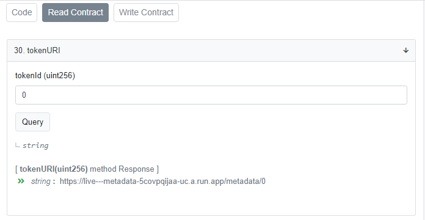

# artbase tools & scripts


Gems:

- [**artbase**](artbase) - artbase ("right-clicker") command line tool & scripts - download complete pixel art collections - yes, you can! - automate "right-click 'n' save" and much more
- [artbase-opensea](artbase-opensea)  - opensea api wrapper / helpers


##  Frequently Asked Questions (F.A.Qs) and Answers


### Q: How can I download all the metadata (one-by-one) for token collections?

Let's try the 10000 Moonbirds collection.

Step 1: Lookup "by hand" the (metadata) token uri/url using the blockchain contract service.   For Moonbirds if you [query the `tokenURI` contract function with
with the `tokenId` 0](https://etherscan.io/address/0x23581767a106ae21c074b2276d25e5c3e136a68b#readContract) ...




... you will get
<https://live---metadata-5covpqijaa-uc.a.run.app/metadata/0>.

And if you open up the url you will get
the metadata in the JSON (JavaScript Object Notation)
data interchange format:


```json
{
  "name":         "#0",
  "image":        "https://live---metadata-5covpqijaa-uc.a.run.app/images/0",
  "external_url": "https://moonbirds.xyz/",
  "attributes": [
    { "trait_type": "Eyes",       "value": "Angry" },
    { "trait_type": "Outerwear",  "value": "Hoodie Down" },
    { "trait_type": "Body",       "value": "Tabby" },
    { "trait_type": "Feathers",   "value": "Gray" },
    { "trait_type": "Background", "value": "Green" },
    { "trait_type": "Beak",       "value": "Small" }
  ]
}
```

Voila!

Step 2:  Use a script to download and save all metadata files
in a loop counting from 0 to 9999.
Let's write the script "from scratch" - `download_meta.rb`:


```ruby
require 'cocos'

(0..9999).each do |id|
   res = wget( "https://live---metadata-5covpqijaa-uc.a.run.app/metadata/#{id}" )

   if res.status.ok?
      ## save metadata - pretty print/reformat json
      write_json( "#{id}.json", res.json )
   else
      puts "!! ERROR: failed to download metadata; sorry - #{res.status.code} #{res.status.message}"
      exit 1
   end
end
```

Run the script - `$ ruby ./download_meta.rb`; resulting in:

```
GET https://live---metadata-5covpqijaa-uc.a.run.app/metadata/0...
GET https://live---metadata-5covpqijaa-uc.a.run.app/metadata/1...
GET https://live---metadata-5covpqijaa-uc.a.run.app/metadata/2...
GET https://live---metadata-5covpqijaa-uc.a.run.app/metadata/3...
...
```

And in your (local) working directory you will find all downloaded, saved and pretty printed / reformated
metadata files:

```
0.json
1.json
2.json
3.json
...
```


### Q: How can I download all images (one-by-one) for token collections?

Let's continue with the 10000 Moonbirds collection.
See "Q: How can I download all the metadata (one-by-one) for token collections?" for the first part (Step 1+2).

Step 3:  Use a script to download and save all image files
(linked to in the metadata) in a loop counting from 0 to 9999.
Let's write the script "from scratch" - `download_images.rb`:


```ruby
require 'cocos'

(0..9999).each do |id|
   ## read (local) metadata
   data = read_json( "#{id}.json" )

   image_url = data['image']

   res = wget( image_url )

   if res.status.ok?
      content_type   = res.content_type
      content_length = res.content_length

      puts "  content_type: #{content_type}, content_length: #{content_length}"

      format = if content_type =~ %r{image/jpeg}i
                 'jpg'
               elsif content_type =~ %r{image/png}i
                 'png'
               elsif content_type =~ %r{image/gif}i
                 'gif'
               else
                 puts "!! ERROR:"
                 puts " unknown image format content type: >#{content_type}<"
                 exit 1
               end

      ## save image - using b(inary) mode
      write_blob( "#{id}.#{format}", res.blob )
   else
      puts "!! ERROR - failed to download image; sorry - #{res.status.code} #{res.status.message}"
      exit 1
   end
end
```

Run the script - `$ ruby ./download_images.rb`; resulting in:

```
GET https://live---metadata-5covpqijaa-uc.a.run.app/images/0...
  content_type: image/png, content_length:
GET https://live---metadata-5covpqijaa-uc.a.run.app/images/1...
  content_type: image/png, content_length:
GET https://live---metadata-5covpqijaa-uc.a.run.app/images/2...
  content_type: image/png, content_length:
GET https://live---metadata-5covpqijaa-uc.a.run.app/images/3...
  content_type: image/png, content_length:...
```

And in your (local) working directory you will find all downloaded and saved
image files:

```
0.png
1.png
2.png
3.png
...
```

That's it.


### Q:  How can I download (metadata or image) files starting with ipfs:// urls - hosted on the peer-to-peer InterPlanetary File System (IPFS) -  via https:// urls using a web client / browser?

Let's try the Noun Punk #1 metadata file
and image hosted on the peer-to-peer InterPlanetary File System (IPFS):

- ipfs://QmUELPeLor9x6369uFnH2yXxhyJ5xQ2agDwPCHiNdP4LYA/1.json
- ipfs://QmU8YNRbju5KrGgPKbQ529FhJsUnPuuHNwndu5x9fXZdSM/1.png

To download a file using a web client / browser - via HyperText Transfer Protocol (HTTP) -
hosted on the peer-to-peer IPFS
use a public web gateway. Try changing the ipfs:// urls to:

- <https://ipfs.io/ipfs/QmUELPeLor9x6369uFnH2yXxhyJ5xQ2agDwPCHiNdP4LYA/1.json>
- <https://ipfs.io/ipfs/QmU8YNRbju5KrGgPKbQ529FhJsUnPuuHNwndu5x9fXZdSM/1.png>

using the "official" IPFS web gateway by Protocol Labs.
Or try:

- <https://cloudflare-ipfs.com/ipfs/QmUELPeLor9x6369uFnH2yXxhyJ5xQ2agDwPCHiNdP4LYA/1.json>
- <https://cloudflare-ipfs.com/ipfs/QmU8YNRbju5KrGgPKbQ529FhJsUnPuuHNwndu5x9fXZdSM/1.png>

using the IPFS web gateway by Cloudfare.


### Troubleshooting

Note: The sample scripts use the  [**cocos (code commons) package / gem**](https://rubygems.org/gems/cocos).
If you get the error `"cannot load such file -- cocos (LoadError)"`
when running a sample script, use `$ gem install cococs` to install the missing cocos (code commons) package /gem.


## License

The scripts are dedicated to the public domain.
Use it as you please with no restrictions whatsoever.


## Questions? Comments?

Yes, you can. Post them on the [D.I.Y. Punk (Pixel) Art reddit](https://old.reddit.com/r/DIYPunkArt). Thanks.


