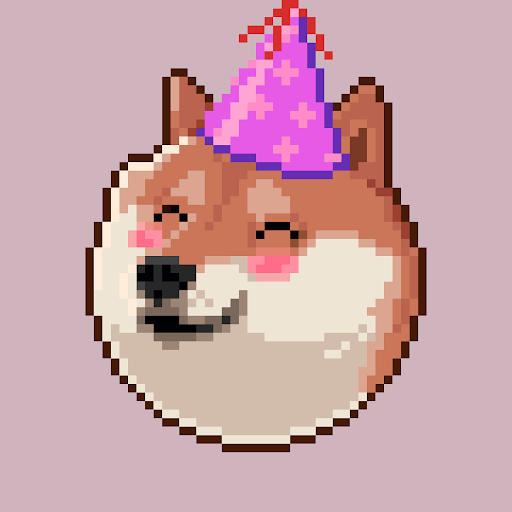

# artbase ("right-clicker") command line tool & scripts - download complete pixel art collections - yes, you can! - automate "right-click 'n' download" and much more

* home  :: [github.com/pixelartexchange/artbase](https://github.com/pixelartexchange/artbase)
* bugs  :: [github.com/pixelartexchange/artbase/issues](https://github.com/pixelartexchange/artbase/issues)
* gem   :: [rubygems.org/gems/artbase](https://rubygems.org/gems/artbase)
* rdoc  :: [rubydoc.info/gems/artbase](http://rubydoc.info/gems/artbase)


## Usage


Note:  The artbase is alpha - it's still the early days - it's a work-in-progress.


Let's try the 100 Blocky Doge (60x60) collection.


### Step 0  - Collection Configuration Script

Create a directory with the collection slug (e.g. `blockydoge`)
matching the OpenSea collection slug
and add a config script - `blockydoge/config.rb`:

``` ruby
COLLECTION = Collection.new( 'blockydoge', 100,

format: '60x60',
source: '512x512',

#####
#  Blocky Doge #1  => 1
meta_slugify: /^Blocky Doge #(?<num>[0-9]+)$/,
)
```

Sorry for now for the "magic" config format  -
see the [**opensea.sandbox**](https://github.com/pixelartexchange/opensea.sandbox) for many more "real-world" examples.


That's it now you can:

- Download all meta data files via the OpenSea API
- Download all referenced images in the meta data file
- Pixelate all downloaded images from the source format (e.g. 512x512) to the original format (e.g. 60x60)
- Generate an all-in-one composite with the pixelated images
- Export all meta data attributes / traits to an all-in-one datafile in the comma-separated-values (.csv) format


### Download all meta data files via the OpenSea API

Let's try:

```
$ artbase blockydoge meta
```

Note: All meta data files get stored by convention in `blockydoge/meta`.
Resulting in a file tree like:

```
blockydoge/meta/
  0.json
  1.json
  2.json
  3.json
  4.json
  5.json
  6.json
  7.json
  8.json
  9.json
  10.json
  11.json
  12.json
  ...
```

Example - `blockydoge/meta/0.json`:

``` json
{
  "id":                  52224520,
  "token_id":            "154226446513437...7290852067901441",
  "num_sales":           1,
  "image_url":           "https://lh3.googleusercontent.com/fIQQ0A7...gTlbgMTQ",
  "image_preview_url":   "https://lh3.googleusercontent.com/fIQQ0A7...gTlbgMTQ=s250",
  "image_thumbnail_url": "https://lh3.googleusercontent.com/fIQQ0A7...gTlbgMTQ=s128",
  "image_original_url":  null,
  "name":                "Blocky Doge #1",
  "description":         "Blocky Doge ... 100 unique pixelated Doge avatars...",
  "external_link":       null,

  ...

   "traits": [
       { "trait_type": "Fur",        "value": "Red Fur",        ... },
       { "trait_type": "Hat",        "value": "Pink Party Hat", ... },
       { "trait_type": "Expression", "value": "Smiley",         ... },
  ],

  ...
}
```


### Download all referenced images in the meta data file

Let's try:

```
$ artbase blockydoge img
```

Note: All referenced images (in the source format e.g. 512x512)
get stored by convention in `blockydoge/i`.
Resulting in a file tree like:

```
blockydoge/i/
  0.png
  1.png
  2.png
  3.png
  4.png
  5.png
  6.png
  7.png
  8.png
  9.png
  10.png
  11.png
  12.png
  ...
```

Example - `blockydoge/i/0.png` (512x512):




### Pixelate all downloaded images from the source format (e.g. 512x512) to the original format (e.g. 60x60)

Let's try:

```
$ artbase blockydoge px
```

Note: All referenced images pixelated down to the orginal format (e.g. 60x60)
get stored by convention in `blockydoge/ii`.
Resulting in a tree like:

```
blockydoge/ii/
  000001.png
  000002.png
  000003.png
  000004.png
  000005.png
  000006.png
  000007.png
  000008.png
  000009.png
  000010.png
  000011.png
  000012.png
  000013.png
  ...
```


Example - `blockydoge/ii/000001.png` to `000013.png` (60x60):


### Generate an all-in-one composite with the pixelated images

Let's try:

```
$ artbase blockydoge composite
```

Note: The all-in-one composite image gets saved by convention to `blockydoge/tmp/blockydoge-60x60.png`.  Example:


### Export all meta data attributes / traits to an all-in-one datafile in the comma-separated-values (.csv) format


Let's try:

```
$ artbase blockydoge export
```

Note: The all-in-one datafile gets saved by convention to `blockydoge/tmp/blockydoge.csv`.
Example:


```
ID, Name, Fur, Hat, Expression, Glasses, Accessories, Mask, Collar
0, Blocky Doge #1, Red Fur, Pink Party Hat, Smiley, , , ,
1, Blocky Doge #2, Black and Tan Fur, Orange Cap, Tongue Out, , , ,
2, Blocky Doge #3, , , Cream Fur, Teal Glasses, , ,
3, Blocky Doge #4, Meme Fur, , , Maroon Glasses, , ,
4, Blocky Doge #5, Black and Tan Fur, Blue Party Hat, , , , ,
5, Blocky Doge #6, Red Fur, Pink Cap, , , , ,
6, Blocky Doge #7, Red Fur, , , , None, ,
7, Blocky Doge #8, Meme Fur, White Cap, , , , ,
8, Blocky Doge #9, Cream Fur, , , Sunglasses, , ,
9, Blocky Doge #10, Meme Fur, , , , , Lavender Mask,
10, Blocky Doge #11, Black and Tan Fur, , , Black Glasses, , ,
11, Blocky Doge #12, Black and Tan Fur, , , , , Salmon Mask,
12, Blocky Doge #13, Cream Fur, Green Party Hat, , , , ,
...
```


That's it for now.


## Install

Just install the gem:

    $ gem install artbase


## License

The `artbase` scripts are dedicated to the public domain.
Use it as you please with no restrictions whatsoever.


## Questions? Comments?

Post them on the [CryptoPunksDev reddit](https://old.reddit.com/r/CryptoPunksDev). Thanks.
